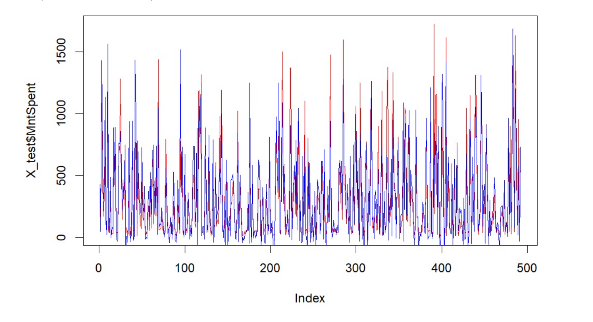

```{r setup, include=FALSE}
knitr::opts_chunk$set(echo = FALSE)
```

# Content 1. Introduce
## Introducing team members

- *Le Hoang Khang - 20133050*
- *Nguyen Thanh Hung - 20133045*
- *Phan Quoc Luu - 20133065*

## Introduction to the topic of data sets

- Topic: Let's say you're a marketing analyst and you've been told by your manager that recent marketing campaigns aren't performing as expected. You need to analyze this data set to recommend solutions for your company according to the data set

- Link data: https://www.kaggle.com/code/jennifercrockett/marketing-analytics-eda-task-final/data

# Content 2.Data

- Information about which columns to use: 2240 obs. of  28 variables:

- ID: Customer's unique identifier
- Year_Birth: Customer's birth year
- Education: Customer's education level
- Marital_Status:  Customer's marital status
- Income: Customer's yearly household income
- Kidhome:  Number of children in customer's household
- Teenhome: Number of teenagers in customer's household
- Dt_Customer: Date of customer's enrollment with the company
- Recency: Number of days since customer's last purchase
- Complain: 1 if the customer complained in the last 2 years, 0 otherwise
- MntWines: Amount spent on wine in last 2 years
- MntFruits: Amount spent on fruits in last 2 years
- MntMeatProducts: Amount spent on meat in last 2 years
- MntFishProducts: Amount spent on fish in last 2 years
- MntSweetProducts: Amount spent on sweets in last 2 years
- MntGoldProds: Amount spent on gold in last 2 years
- NumDealsPurchases: Number of purchases made with a discount
- AcceptedCmp1: 1 if customer accepted the offer in the 1st campaign, 0 otherwise
- AcceptedCmp2: 1 if customer accepted the offer in the 2nd campaign, 0 otherwise
- AcceptedCmp3: 1 if customer accepted the offer in the 3rd campaign, 0 otherwise
- AcceptedCmp4: 1 if customer accepted the offer in the 4th campaign, 0 otherwise
- AcceptedCmp5: 1 if customer accepted the offer in the 5th campaign, 0 otherwise
- Response: 1 if customer accepted the offer in the last campaign, 0 otherwise
- Country: Customer's address
- NumWebPurchases: Number of purchases made through the company’s website
- NumCatalogPurchases: Number of purchases made using a catalogue
- NumStorePurchases: Number of purchases made directly in stores
- NumWebVistisMonth: Number of visits to company’s website in the last month

# Content 3. Data analysis plan

- The outcome (Y) and explanatory (X) variables that the team will use to answer the question:
    -  Explanatory variable (X): Education, Marital_Status, Income, Year_Birth, Num...
    -  Vriable outcome AcceptedCmp..., Response, Mnt...
- **Analysis goal**
    -   **Data cleaning**
        -   Eliminate nulls and outliers
        
        -   Convert data columns to required form
        
        -   Create some columns needed for analysis
<!-- -->

    -   **Statistical analysis:**
        
        -  Is there a relationship between the region and the acceptance of a campaign (latest campaign)?
        
        -  Is there a relationship between those with or without children and the acceptance of the most successful campaigns ?
<!-- -->
    -   **In-depth analytics using Machine Learning: **  
    
        -   Predict total customer spending based on personal income, number of purchases by methods, ... (Algorithm Linear Regression )
        
        -    Predict campaign acceptability of customers based on purchases, income, marital status, number of children in the family..... (Algorithm Logistic Regression)
<!-- -->        
    -   **Data visualization**
        - Acceptance rate of marketing campaigns by region?
        - Which sales method is the least effective?
        - Which products account for the most revenue?
        - The most successful and the worst campaign?
    -   **Conclusion**
        -   Make comments and measures to improve the campaign

# Content 4. Accomplish goals

## 4.1. Data cleaning

- Marital status is divided into two large groups: single (alone, divorced, single, widow) and couple (married, together).
- Create a MntSpent column from MntFishProducts, MntMeatProducts, MntFruits, MntSweetProducts, MntWines, MntGoldProds columns.
- Create column NumPurchases including columns NumCatalog Purchases, NumStorePurchases, NumWebPurchases.
- The TotalAccepted column includes AcceptedCmp1, AcceptedCmp2, AcceptedCmp3, AcceptedCmp4, AcceptedCmp5.
- The child column is the column that categorizes customers with or without children.
- Remove outliers, null values, unnecessary columns.

## 4.2. Statistical analysis

### 4.2.1 Question number 1
- Is there a relationship between customers in each region and acceptance of a campaign (latest campaign)?
    -   The group's hypothesis
    
      -    Ho: There is no relationship between customers in each region with the acceptance of 1 campaign
      
      -    Ha: There is a relationship between customers in each region with the acceptance of 1 campaign
      
- Count of accept or disapproval by country


- Create a matrix with the number of rows being the number of countries, and the column consisting of 2 columns (the first column is the number of people who accept the campaign, the second column is the number of people who do not accept the campaign).
- Use chi-squared test to test the above hypothesis.


#### Comment
- With p-value = 0.06108 not less than 0.05, we cannot reject hypothesis Ho (reject Ha). We cannot conclude that there is a relationship between customers in each region and campaign adoption (2 completely independent variables).

### 4.2.2 Question number 2
-  Is there a relationship between those with or without children and campaign acceptance (most successful) ?
    - The group's hypothesis:
    
      <!-- Ho: Không có mối quan hệ giữa những người có con hoặc không có con và sự chấp nhận chiến dịch -->
      - Ho: There is no relationship between those with or without children and campaign acceptance
      
          <!-- Ha: Có mối quan hệ giữa những người có con hoặc không có con và sự chấp nhận chiến dịch -->
      - Ha: Is there a relationship between people with or without children and campaign acceptance
      
<!-- - Đếm số lượt chấp nhận hoặc không chấp nhận theo những người có con hoặc không có con -->

- Count the accept or disapproval by people with or without children


-  Create a matrix with the number of rows being the number of people with or without children, and a column of 2 columns (the first column is the number of people who accept the campaign, the second column is the number of people who do not accept the campaign).

- Use chi-squared test to test the above hypothesis


#### Comment
- With p-value = 0.0004075 less than 0.0001, we reject hypothesis Ho (accept Ha). We can conclude that there is a relationship between people with or without children and campaign acceptance (these two variables influence each other).se chi-squared test to test the above hypothesis.

# 4.2.3  Predict total customer spending based on personal income, number of purchases by methods, ... (**Algorithm Linear Regression**)
- Divide the model into 2 parts (70% train, 30% test)

- Train the model after finding influential values

- #R-squared = 0.8432 The model showed that the explanatory variables or the model correctly predicted about 84.32% of the results
- #Adj R-squared = 0.8425 : Called R-squared, it represents the independent variables in the model that are explaining about 84.25% of the variation of the dependent variable NumPurchases in the model.

- The graph shows the dispersion of the error

- Visualize some variables that affect the model


- Compare actual value and predicted value

- The line chart above, shows 2 actual data sets, and the prediction, looking at the chart, it can be seen that the predicted data is also quite consistent with reality. Shows a good predictive model in the test dataset.

- **Đánh giá mô hình**
    + We often use root-mean-square error, = , because it has the same units as yi(actual)
    + RMSE (Original Mean Squared Error) prediction error, which represents the average difference between the known outcome values observed in the test data and the model's predicted outcome values. The lower the RMSE, the better the model.

- The predictive model on the test set explains 91% of the variation of the dependent variables. This level of explanation is said to be quite good
    
# Predict campaign acceptability of customers based on purchases, income, marital status, number of children in the family.....(**Algorithm Logistic Regression**)

- Divide the model into 2 parts (70% train, 30% test)


- 87% predictive model


- Construct a matrix to compare the actual and predicted values


- Calculate sensitivity: In a successful actual campaign, 20% are predicted to be successful
- Calculate specificity: Of the actual campaign that failed, 87% were forecast to fail

#### Comment
- The significance of the result: 1 (credit default) the prediction accuracy rate is not high
- Result : High accuracy 87% but quite low sensitivity with 20%: Can't predict the actual campaign success


- The AUC curve indicator shows the model predictability with a success rate of 83%, showing that the model predicts quite well in terms of true negatives and true positives.

# 4.3. Data visualization

## 4.3.1 Acceptance rate of marketing campaigns by region ?


### Comment
- From the chart above, we can see that the adoption rate of campaigns 1,3,4,5 across all countries is roughly the same (except ME country)
- There are 3 regions "AUS", "ME", "US" that have not yet accepted the 2nd campaign, so we should propose the corresponding campaign to increase the acceptance rate across countries

## 4.3.2 Which sales method is the least effective ?


### Comment
- From the chart above, we can see that the number of direct purchases in stores and online purchases accounts for a high percentage. In which, shopping at popular stores
- The number of purchases by category and the number of purchases with discounts is still quite low. Therefore, it is necessary to devise advertising strategies in the media to attract the attention of more customers

## 4.3.3 Which products account for the most revenue?


### Comment
- It can be seen that alcohol is a good-selling item. Fruits and sweets receive a lot of attention from consumers

## 4.4.4 The most successful and the worst campaign ?


### Comment
- Campaigns 3, 4 are better than the rest
- Campaign 2 is the most economical one

# Conclusion
- The most successful products were wine and meat (i.e. the average customer spent the most on these items). Recommendation: focus advertising campaigns to increase sales of few items more popular).
- Campaign 2 is the underperforming campaign in all applicable regions. Can remove campaign 2 or apply models of campaign 3,4 to campaign 2
- The top selling method is in-store, followed by website sales.
- Encourage to focus advertising campaigns in more successful sales methods to reach more customers and also to increase sales of underperforming products.
- Regular customers are those who buy products through all three methods. As stated before, Web & Catalog purchases have a positive impact on in-store purchases. Propose a unique reward system for the store method that will increase consumer engagement and is expected and will increase the number of in-store purchases