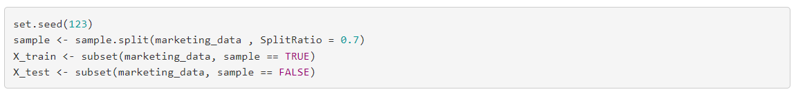
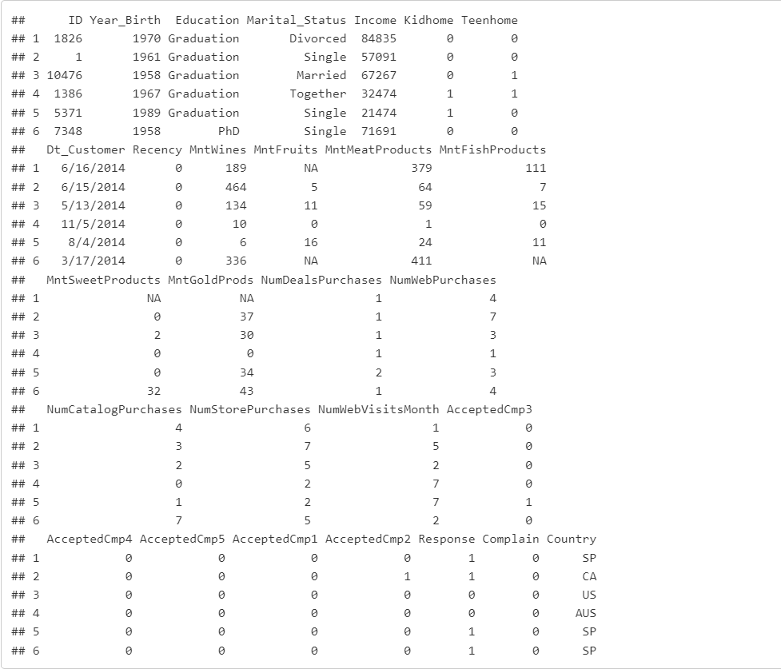
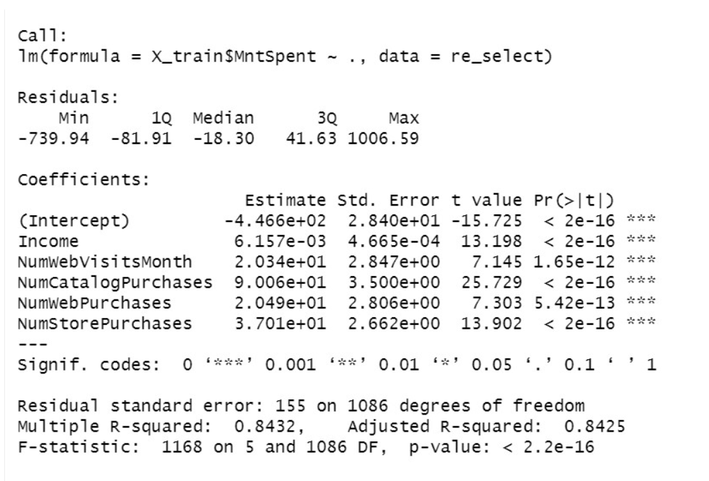
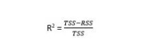
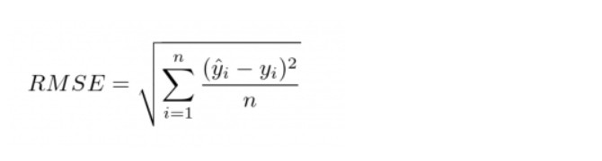
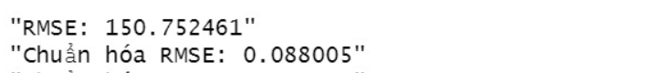
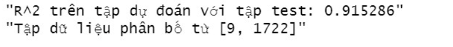
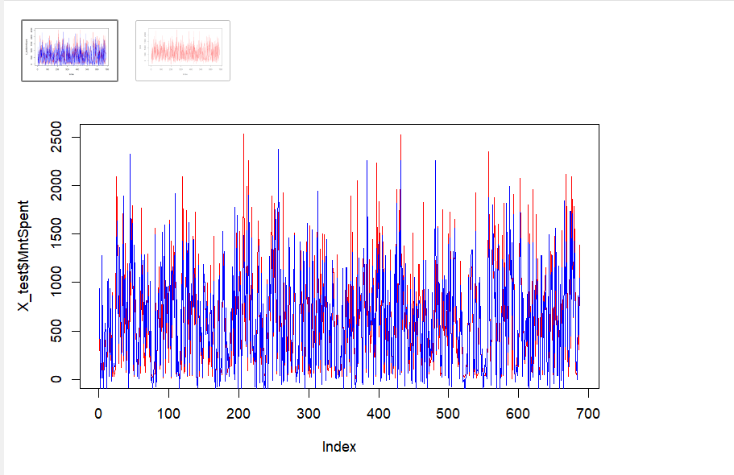
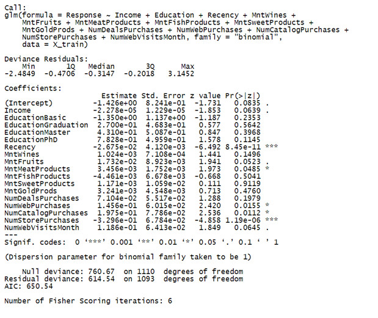
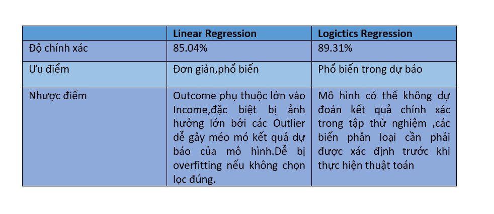

## **1. Tóm Tắt**
- Giới thiệu về cách dữ liệu được thu thập.

  - Một Giám đốc tiếp thị cho biết rằng các chiến dịch tiếp thị gần đây không đạt được hiệu quả như mong đợi muốn tìm hiểu nguyên nhân và muốn có giải pháp bằng cách phân tích dữ liệu về hồ sơ khách hàng, Sở thích sản phẩm, chiến dịch khuyến mãi thành công thất       bại,Hiệu suất các kênh bán hàng Công ty bán nhiều mặt hàng khác nhau(thịt, cá, đồ ngọt,vàng, rượu, trái cây), được bán ở tại cửa      hàng và trên trang web...Mà khách hàng của công ty thuộc nhiều tầng lớp trong xã hội ở nhiều nước (độ tuổi, ngành nghề, thu            nhập,..). Dữ liệu là lịch sử mua hàng của khách hàng qua các kênh bán hàng của công ty và các chiến lược khuyến mãi của công ty được khách hàng áp dụng.
  - Các phương pháp mà nhóm sử dụng ở đây là:  
    + Kiểm định giả thuyết thống kê Chi-Square
    + Trực quan hóa dữ liệu
    + Sử dụng mô hình: Linear regression, Logistic regression để dự đoán kết quả theo câu hỏi nhóm đặt ra.
    + Phân tích thăm dò (Exploratory Analysis) 
    + Xác định và phân loại (các) biến có liên quan, chúng ta sử dụng phương pháp phân tích dữ liệu thăm dò để giúp nhóm tóm tắt các đặc điểm quan trọng của dữ liệu.
  - Kết quả nghiên cứu: Tìm ra các chiến dịch thành công và thất bại đưa ra dự đoán tổng chi tiêu trong tương lai khả năng chấp nhận 1 chiến dịch 

## **2. Giới Thiệu **
  - Những yếu tố có liên quan đến việc mua hàng tại cửa hàng ?
    + Nhằm có cái nhìn trực quan về những yếu tố ảnh hưởng lớn đến lượt mua hàng.
  - Mối quan hệ giữa thu nhập hằng năm và số tiền chi tiêu có ý nghĩa thống kê hay không ?
    + Câu hỏi này nhằm kiểm tra có mối liên quan giữa hai biến định lượng này.
  - Tỷ lệ chấp nhận các chiến dịch tiếp thị theo từng khu vực ?
    + Xây dựng biểu đồ để người xem có cái nhìn trực quan về tỷ lệ chấp nhận các chiến dịch.
  - Chiến dịch tiếp thị thành công nhất ? 
    + Trực quan hóa để có cái nhìn về chiến dịch nào đã hoạt động tốt,thành công.
  - Phương thức bán hàng nào kém hiệu quả nhất ?
    + Trực quan dữ liệu để thấy phương thức nào đã thất bại trong chiến dịch này.
  - Quốc gia có tổng số lần mua hàng và chi tiêu cao nhất ?
    + Trực quan hoá dữ liệu xem mức chi tiêu cao nhất của các vùng và đưa ra các sản phẩm phù hợp. 
  - Sản phẩm nào chiếm doanh thu nhiều nhất ?
    + Xây dựng biểu đồ thấy được sản phẩm nào bán chạy và mang về doanh thu tốt. 
  - Dự đoán mức chi tiêu của khách hàng dựa trên thu nhập cá nhân, tổng số lượt mua hàng, tình trạng hôn nhân
    + Từ mô hình học máy dự đoán mức chi tiêu khách hàng đưa ra chiến dịch maketing
      - Để chuẩn đoán cần input là: Income, TotalKid, MntSpent, NumWebVisitsMonth, NumDealsPurchases, NumCatalogPurchases, NumWebPurchases, NumStorePurchases.
      - Kết quả là biến: MntSpent (Tổng lược mua hàng )

  - Dự đoán khả năng chấp nhận chiến dịch của khách hàng dựa vào lượt mua hàng, thu nhập, tình trạng hôn nhân, số con trong gia đình, ...
    + Từ mô hình học máy dự đoán khả năng chấp nhận chiến dịch
      - Để chuẩn đoán cần input là 14 biến:(Income, Education, Recency, MntWines, MntFruits, MntMeatProducts, MntFishProducts, MntSweetProducts, MntGoldProds, NumDealsPurchases, NumWebPurchases, NumCatalogPurchases, NumStorePurchases, NumWebVisitsMonth)
      - Kết quả là biến: Response (1: chấp nhân chiến dịch, 0: không chấp nhận chiến dịch )

## **3. Dữ liệu **
  - Nguồn thu thập: https://www.kaggle.com/jackdaoud/eda-statistics-analysis-with-marketing-data#notebook-container Bộ dữ liệu được cung cấp công khai trên Kaggle
  - 28 thuộc tính:
    + ID: Mã định danh
  + Year_Birth: Năm sinh
  + Education: Trình độ học vấn
  + Marital_Status: Tình trạng hôn nhân
  + Income: Thu nhập hằng năm
  + Kidhome: Số trẻ em trong gia đình
  + Teenhome: Số thanh thiếu niên trong gia đình
  + Dt_Customer: Ngày đăng ký
  + Recency: Số ngày kể từ lần mua hàng cuối cùng
  + MntWines: Chi phí cho rượu trong 2 năm qua
  + MntFruits: Chi phí cho hoa quả trong 2 năm qua
  + MntMeatProducts: Chi phí cho thịt trong 2 năm qua
  + MntFishProducts: Chi phí cho cá trong 2 năm qua
  + MntSweetProducts: Chi phí cho đồ ngọt trong 2 năm qua
  + MntGoldProds: Chi phí cho vàng trong 2 năm qua
  + NumDealsPurchases: Số lần mua hàng được giảm giá
  + NumWebPurchases: Số lần mua hàng trên web của cửa hàng
  + NumCatalogPurchases: Số lần mua hàng theo danh mục
  + NumStorePurchases: Số lần mua hàng tại cửa hàng
  + NumWebVistisMonth: Số lần truy cập vào trang web của công ty tháng trước
  + AcceptedCmp1: Chấp nhận đề nghị chiến dịch thứ 1 (1 nếu khách hàng chấp nhận, 0 là ngược lại)
  + AcceptedCmp2: Chấp nhận đề nghị chiến dịch thứ 2 (1 nếu khách hàng chấp nhận, 0 là ngược lại)
  + AcceptedCmp3: Chấp nhận đề nghị chiến dịch thứ 3 (1 nếu khách hàng chấp nhận, 0 là ngược lại)
  + AcceptedCmp4: Chấp nhận đề nghị chiến dịch thứ 4 (1 nếu khách hàng chấp nhận, 0 là ngược lại)
  + AcceptedCmp5: Chấp nhận đề nghị chiến dịch thứ 5 (1 nếu khách hàng chấp nhận, 0 là ngược lại)
  + Response: Chấp nhận đề nghị chiến dịch cuối cùng (1 nếu khách hàng chấp nhận, 0 là ngược lại)
  + Complain: Lời phần nàn trong 2 năm qua
  + Country: Địa chỉ khách hàng

  - Để có file dữ liệu tương đối ổn, nhóm đã xử lý sơ bộ trong file csv bằng cách xóa những biến không cần thiết, xóa giá trị ngoại lai chuyển đổi kiểu dữ liệu, xóa các giá trị NULL và NA. Sau đó, nhóm thêm các cột MntSpent, NumPurchases,.. 
  -Tách tập dữ liệu thành tập Train và Test với tỷ lệ 7/3
  
  - Một vài dòng Trainning Example

## **4. Trực quan hóa dữ liệu (data visulization) **
 - 4.1 Tỷ lệ chấp nhận các chiến dịch phân theo vùng ?
  
    + Từ biểu đồ trên,ta có thể thấy rằng tỷ lệ chấp nhận của các chiến dịch 1,3,4,5 trên khắp tất cả các quốc gia gần gần giống nhau (ngoại trừ quốc gia         ME) 
    + Có 3 vùng "AUS", "ME", "US" chưa chấp nhận chiến dich số 2 ta nên đề xuất chiến dịch tương ứng để tăng tỉ lệ chấp nhận trên các quốc gia 
    
 - 4.2 Phương thức bán hàng nào hiệu quả nhất ?
  
    + Từ biểu đồ trên,ta có thể thấy rằng số lần mua hàng trực tiếp tại cửa hàng và mua trực tuyến chiếm tỷ lệ cao. Trong đó mua hàng tại cửa hàng được ưa        chuộng
    + Số lần mua hàng theo danh mục và số lần mua hàng được giảm giá còn khá thấp. Do đó cần phải đưa ra các chiến lược quảng cáo trên truyền thông để thu        hút sự chú ý của nhiều khách hàng hơn
 - 4.3 Sản phẩm nào mang lại doanh thu cao nhất cho cửa hàng ?
  
    + Có thể thấy trong cơ cấu doanh thu thì Rượu chiếm tỉ trọng cao nhất, tiếp theo là Thịt và Vàng 
    + Dễ dàng nhận thấy các chiến dịch  trên 3 dòng sản phẩm này khá tốt. Từ đó nên đẩy mạnh chiến dịch marketing đã và đang diễn ra trên 3 sản phẩm này.
 - 4.4 Chiến dịch nào đã thực hiện và mang lại thành công ?
 
    + Dễ dàng nhận thấy trong số cá chiến dịch marketing đã thực hiện thì chiến dịch số 3, 4 cho kết quả tốt hơn các chiến dịch còn lại
    + Cần Chiến dịch 2 là chiến dịch tế nhất.
    + Cần loại bỏ chiến dịch 2 ra khỏi chiến dịch tiếp thị.
    + Cần củng cố và đầu tư thêm cho 2 chiến dịch 3 và 4. Cải thiện chiến dịch 1 và 5 để mang lại kết quả tốt hơn.

## **5. Mô hình hóa dữ liệu ( data modeling ) **
  - 5.1 Xây dựng mô hình dự đoán mức chi tiêu dựa vào bộ dữ liệu marketing_data.csv
    + Mô hình hồi quy tuyên tính (linear regression): f(x)=w1x1 + w2x2 + w3x3 +wnxn +w0
    + Linear regression là: Một phương pháp thống kê để hồi quy dữ liệu với biến phụ thuộc có giá trị liên tục trong khi các biến độc lập có thể có một trong hai giá trị liên tục hoặc là giá trị phân loại. Nói cách khác "Hồi quy tuyến tính" là một phương pháp để dự đoán biến phụ thuộc (Y) dựa trên giá trị của biến độc lập (X). Có thể được sử dụng cho các trường hợp chúng ta muốn dự đoán một số lượng liên tục.
    + Ý tưởng thuật toán:
      + Tím kiếm hệ số góc thõa mãn tất cả các input mà cho ra được output theo tập dữ liệu mẫu.Tối ưu mô hình theo OLS.
    + Các bước thực hiện:
      + B1: Chia tập dữ liệu thành 2 phần,Tập train để huấn luyện mô hình, tập train dùng để dự đoán kết quá,thực hiện đánh giá mô hình tuyến tính
      + B2: Thực hiện kiểm tra,lọc và xóa hết các outlier để tránh làm sai mô hình.
      + B3: Thực hiện train mô hình lầ thứ nhất
      + B4: Chọn lại các biến có ảnh hưởng lớn đển kết quả mô hình sau khi huấn luyện lần 1.
      + B5: Sử dụng các biến vừa lọc huẩn luyện lần 2 để có kết quả tốt hơn.
      + B6: Thực hiện dự đoán, đánh giá mô hình trên tập test_data.
  - 5.2 Logistic regression:
    + Hồi quy logistic là một loại phân tích thống kê được sử dụng để dự đoán kết quả của một biến phụ thuộc là biến phân loại (chấp nhận, không chấp nhận) và biến phụ thuộc 
    + Mục tiêu hồi quy logistic tìm ra  mối liên quan giữa biến kết quả và biến phụ thuộc (có ảnh hưởng hay không) và đánh giá mô hình 
    + Ý tưởng thuật toán 
      + B1: Chia tập dữ liệu thành 2 phần, tập train để huấn luyện mô hình, thực hiện đánh giá mô hình logistic.
      + B2: Thực hiện kiểm tra,lọc và xóa hết các outlier để tránh làm sai mô hình.
      + B3: Xây dựng mô hình logistic và train mô hình.
      + B4: Đưa ra dự đoán với 'Response' là xác suất kiểm tra kết quả .
      + B5: xây dựng ma trận nhằm lẫn và đường ROC đánh giá mô hình.
      
## **6. Thực nghiệm, kết quả, và thảo luận (experiments, results, and discussions) **
  - 6.1 Linear regression:
  
   + Sử dụng  nguyên lý out-of-sample validation để đánh giá mô hình:
     
     
     
     
   + R-squared Độ mạnh của mô hình với sự dao động từ 0 đến 1.Thường ta sẽ hi vọng mô hình của mình trên mức ý nghĩa 0.5.Nghĩa là khoảng 50% của phương sai biến phụ thuộc Y dự đoán được từ biến độc lập X là tốt,còn lại là sai số mà Y không thể dự đoán được từ X.Hay là các biến độc lập giãi thích được bao nhiêu phần trăm sự thay đổi hay biến thiên trong biến phụ thuộc. R^2=(TSS-RSS)/TSS
   
   
   + Lỗi dự đoán RMSE (Lỗi bình phương trung bình gốc), biểu thị chênh lệch trung bình giữa các giá trị kết quả đã biết được quan sát trong dữ liệu thử nghiệm và các giá trị kết quả dự đoán của mô hình. RMSE càng thấp, mô hình càng tốt.
  - Ta thường dùng root-mean-square error, 𝑅𝑀𝑆𝐸 = √𝑀𝑆𝐸, vì nó có cùng đơn vị với yi(thực tế)
  - RMSE,R-square trên tập train là :155,0.8432.
  - RMSE,R-square trên test: 158,0.89.
  
  
    + R-square trên mô hình tập test dùng để đánh giá mô hình cho kết quả cao hơn ở tập train.Cho thấy mức độ giãi thích được kết quả theo các biến tốt hơn.Và ở cả 2 mô hình đều cho kết quả trên 0.8 > 0.5,được cho là tốt .
    + Chỉ số RMSE trên tập test cho ra kết quả lớn hơn trên tập test nhưng không quá lớn,sau khi dùng công thức để chuẩn hóa RMSE bằng cách chia cho khoảng giá trị của biến dự đoán trên tập test "RMSE/(max-min)*100 
    - Ta được 0.1 (10%) là kết quả thấp,sai số này có thể chấp nhận được (RMSE chấp nhận được ở dưới mức 25%)
  - Cho thấy mô hình hồi quy tuyến tính này là một mô hình dự đoán tốt trên tập test.
    + Ảnh dưới thể hiện kết quả trên tập train và test khớp nhau khoản 90%.
  
  - Ở mô hình này,chúng em đã cố gắng loại bỏ tất cả outlier ở các biến số nhằm xây dựng mô hình có kết quả tốt nhất.Bởi vì :
    + Các phần tử bất thường (Outliers) có thể là nguyên nhân gây ra sự vi phạm các giả thiết của mô hình hồi quy tuyến tính và làm méo mó kết quả dự báo của mô hình.
    + outliers có ảnh hưởng rất mạnh đến kết quảcủa OLS
    + Loại bỏ outliers theo tiêu chuẩn nằm ngoài 2 lần độ lệch chuẩn so với mean phần dư
    
  - 6.2 Logistic regression: 
  
   

  - Theo quan sát mô hình, các biến ảnh hưởng đến chiến dịch là: NumWebVisitsMonth NumStorePurchases,MntMeatProducts, MntGoldProds, MntWines,Recency
  - Giải thích mô hình 
    +	formula = Response là biến phân loại(có hoặc không ) mô hình mới có ý nghĩa
    +	Trong glm có nhiều luật phân phối, mà trong đó phân phối nhị phân (binomial) là một luật phân phối chuẩn cho hồi qui logistic. Do đó,family=”binomial”
    +	Deviance Residuals: giải thích phản ánh độ khác biệt giữa mô hình và dữ liệu
    +	Null deviance: mô hình không có biến phân loại (có hoặc không )
    +	Residual deviance: mô hình với biến phân loại(có hoặc không )
    + Chỉ báo đường cong AUC thể hiện khả năng dự đoán của mô hình với tỷ lệ thành công là 84%, cho thấy mô hình dự đoán khá tốt cả về âm tính thực và dương tính thực.
      

    
## **7. Kết luận (conclusions) **

  - Qua quá trình thực hiện đề tài nhóm em đã học hỏi được thêm kiến thức về học máy ứng dụng ngôn ngữ R cho phân tích dữ liệu. Về tổng quan đề tài đã hoàn thành mức cơ bản, trả lời được các câu hỏi nhóm đã đặt ra với bộ dữ liệu. Tuy nhiên kết quả dự đoán của các mô hình trong đề tài chưa được cao.Sau đây là nhận xét về các thuật toán nhóm đã sử dụng :
  
    
  - Hướng phát triển đề tài:Nhóm em sẽ tiếp tục cải thiện mô hình hồi quy logictics ,cố gắng giảm thiểu variance của các mô hình bằng cách loại bỏ bớt các biến có độ tương quan quá thấp.Sẽ xây dựng 1 mô hình phân loại KNN dựa trên chỉ số RFM(Rencency - Frequency -M(Monetary Value)).Sử dụng để phân tích giá trị khách hàng (Customer Value), từ đó giúp doanh nghiệp có thể phân tích ra từng nhóm khách hàng mà mình đang có những chiến dịch marketing hoặc chăm sóc đặc biệt.
  
## **8.Phụ lục (contributions)  **

  
## **9.Đóng góp (contributions)  **
  - Nhóm trưởng: Nguyễn Thanh Hùng  MSSV: 20133045
    + Công việc: Phần 1:Giới thiệu.
      + Xây dựng thuật toán Linear regression.
      + Câu 1(Data visualize):Tỷ lệ chấp nhận các chiến dịch phân theo vùng ?
      + Viết Report.
  - Thành viên: Lê Hoàng Khang MSSV: 20133050
    + Công việc: Làm sạch dữ liệu,các bước tiền xử lí.
      + Kiểm định giả thuyết Chi-Square.
      + Câu 2 (Data visualize): Phương thức bán hàng nào hiệu quả nhất ?
      + Câu 3 (Data visualize): Sản phẩm nào mang lại doanh thu cao nhất cho cửa hàng ?
      + Viết Presentation.
  - Thành viên: Phan Quốc Lưu MSSV: 20133065
    + Công việc: Xây dựng thuật toán Logictics regression.
      + Câu 4 (Data visualize): Chiến dịch nào đã thực hiện và mang lại thành công ?
      + Viết Proposal.

## **10. Tham khảo (references) **
  - Bài báo,sách:
    + What is good RMSE,10/5/2021 https://www.statology.org/what-is-a-good-rmse/.
    + Blog hướng dẫn xử lý các giá trị ngoại lai,10/5/2017 https://rpubs.com/chidungkt/350386.
    + Blog phân tích R trong thuật toán Linear Regression,16/5/2018 https://www.dataquest.io/blog/statistical-learning-for-predictive-modeling-r/.
    + Nguyễn Văn Tuán,Sách phân tích dữ liệu với R tiếng việt.
    + Chi-Square Test in R | Explore the Examples and Essential concepts!,18/6/2018  https://data-flair.training/blogs/chi-square-test-in-r/.
    + Bài giảng phân tích dữ liệu với R https://www.youtube.com/watch?v=3VEgrLX7Gs0&list=PLbRKZL7ww3qj1f1FjDE7Wl6tkZebPPrf2&index=25.
  - Code và thư viện:
    + Jackdaoud,Analysis marketing, https://www.kaggle.com/jackdaoud/eda-statistics-analysis-with-marketing-data#notebook-container.
    + Các thư viện nhóm sử dụng (tidyverse,plyr,ggplot2,gridExtra,cowplot,dplyr,Metrics,caTools,stargazer,ROCR).